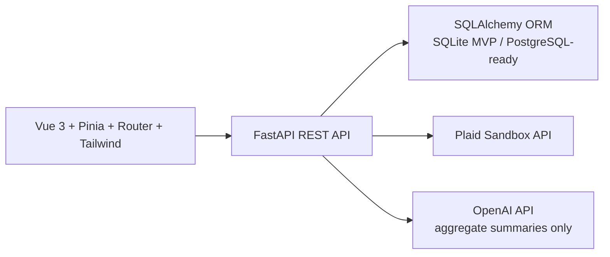

# finance-ai-dashboard

Production-style personal finance AI dashboard with a Vue 3 frontend, FastAPI backend, Plaid Sandbox transaction sync, SQLAlchemy persistence, and OpenAI-powered financial insights generated from summarized data only.

## Architecture



## Backend Setup

```bash
cd backend
python -m venv venv
source venv/bin/activate
pip install -r requirements.txt
cp .env.example .env
uvicorn app.main:app --reload
```

Health check:

```bash
curl http://localhost:8000/health
```

Seed mock data:

```bash
curl -X POST http://localhost:8000/api/transactions/seed
```

Run tests:

```bash
cd backend
pytest
```

## Frontend Setup

```bash
cd frontend
npm install
npm run dev
```

The frontend defaults to `http://localhost:8000` for API calls. Set `VITE_API_BASE_URL` only when the backend runs elsewhere. Do not place Plaid or OpenAI secrets in frontend environment variables.

## Environment Variables

Backend `.env`:

```bash
DATABASE_URL=sqlite:///./finance_ai.db
CORS_ORIGINS=http://localhost:5173,http://127.0.0.1:5173
PLAID_CLIENT_ID=
PLAID_SECRET=
PLAID_ENV=sandbox
OPENAI_API_KEY=
OPENAI_MODEL=gpt-4o-mini
```

## Plaid Sandbox

1. Create a Plaid developer account and get Sandbox `PLAID_CLIENT_ID` and `PLAID_SECRET`.
2. Add credentials to `backend/.env`.
3. Start FastAPI.
4. In the app, open Plaid Connect.
5. Use "Create Link Token" to verify server credentials.
6. For MVP manual flow, paste a Sandbox `public_token`, exchange it, then sync transactions.

TODO: Replace the manual paste flow with full Plaid Link in Vue. Token exchange must remain backend-only.

## Security Notes

- `PLAID_SECRET`, Plaid access tokens, and `OPENAI_API_KEY` are never exposed to the frontend.
- `.env`, database files, caches, `node_modules`, and build artifacts are ignored by Git.
- Plaid access tokens are stored server-side only. Production should add encryption at rest before saving tokens.
- OpenAI receives summarized financial aggregates only: monthly totals, category totals, merchant totals, recurring expenses, income, expenses, savings rate, and debt/payment estimates.
- The AI output includes the disclaimer: "This is not financial advice."

## API Summary

- `GET /health`
- `POST /api/plaid/create_link_token`
- `POST /api/plaid/exchange_public_token`
- `POST /api/plaid/sync_transactions`
- `GET /api/transactions`
- `POST /api/transactions/seed`
- `POST /api/transactions/reset`
- `GET /api/analytics/summary`
- `GET /api/analytics/monthly`
- `GET /api/analytics/categories`
- `GET /api/analytics/merchants`
- `GET /api/analytics/recurring`
- `POST /api/insights/generate`
- `POST /api/goals/debt-payoff`

## Future Improvements

- Full Plaid Link frontend integration.
- User authentication and multi-user isolation.
- Encrypted Plaid item storage with key rotation.
- PostgreSQL migrations with Alembic.
- Budget persistence and editable budget categories.
- Background Plaid sync jobs and webhook handling.
